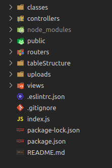

## **Conversor de planilhas exel para HTML ou PDF com Node.JS :rocket:** 

Olá seja bem vindo ao repositório do projeto conversor de planilhas! :page_with_curl:

Este projeto consiste em um sistema monolito na arquitetura MVC, pois toda sua estrutura tanto de back-end quanto de front-end constam no mesmo lugar, foi utilizado para renderizar as paginas HTML a view engine EJS.

Espero que gostem #VQV :rocket:

## Estrutura

`MVC` - MODEL, VIEWS e CONTROLLERS

1. MODEL: É responsável por toda interface com banco de dados, query's, conexão etc. e também responsável pelas regras de negócio. Mas neste projeto não foi utilizada, pois não houve necessidade de banco de dados.
2.  VIEWS: Se encontram todos os arquivos .HTML que renderizam as paginas e interface gráfica do sistema.
3. CONTROLLERS: É responsável em ligar o model com as views, fazendo o meio de campo da arquitetura.
4. PUBLIC: Contém as imagens utilizadas no projeto.
5. ROUTERS:  Possui as rotas da aplicação, sistema de rotas próprio do framework Express.
6. UPLOADS: Destinada ao upload dos arquivos feita na aplicação.
