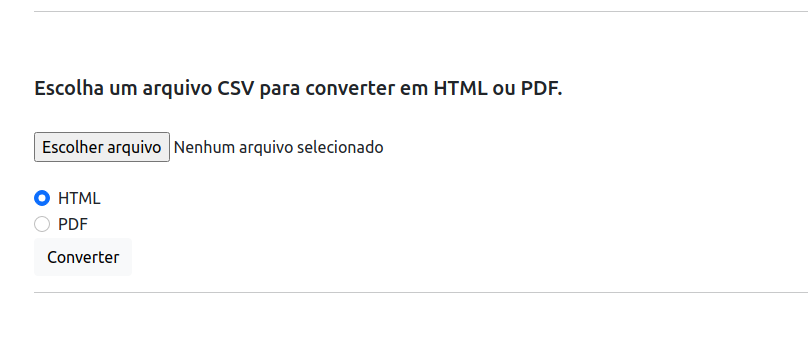
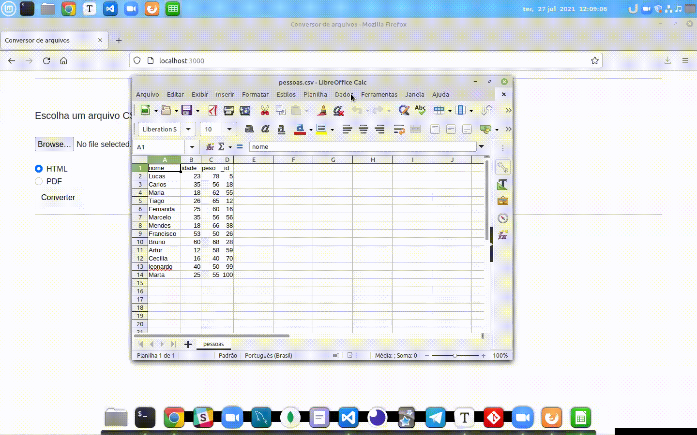

## **Conversor de planilhas excel para HTML ou PDF com Node.JS :rocket: 🚀** 

Olá seja bem vindo ao repositório do projeto conversor de planilhas! :page_with_curl:

Este projeto consiste em um sistema monolito na arquitetura MVC, pois toda sua estrutura tanto de back-end quanto de front-end constam no mesmo lugar, foi utilizado para renderizar as paginas HTML a view engine EJS.

Espero que gostem #VQV :rocket:

## Estrutura

`MVC` - MODEL, VIEWS e CONTROLLERS

1. MODEL: É responsável por toda interface com banco de dados, query's, conexão etc. e também responsável pelas regras de negócio. Mas neste projeto não foi utilizada, pois não houve necessidade de banco de dados.
2.  VIEWS: Se encontram todos os arquivos .HTML que renderizam as paginas e interface gráfica do sistema.
3. CONTROLLERS: É responsável em ligar o model com as views, fazendo o meio de campo da arquitetura.
4. PUBLIC: Contém as imagens utilizadas no projeto.
5. ROUTERS:  Possui as rotas da aplicação, sistema de rotas próprio do framework Express.
6. UPLOADS: Destinada ao upload dos arquivos feita na aplicação.

## tecnologias utilizadas

- Linguagens:
  - NodeJs
- Framework's:
  - Express
- View engine:
  - EJS
- Estilos:
  - Bootstrap
- Upload de Arquivos:
  - Multer
- Conversor PDF:
  - html-pdf
- Facilitador de desenvolvimento:
  - nodemon
- Organização e Padronização de codigo:
  - Eslint / config-airbnb-base

## Avisos

- Este projeto necessita apenas do NodeJs instalado em seu computador para rodar localmente.
- As demais dependêcias serão instaladas com comando npm install

## Começando

- Clone o repositório git clone git@github.com:clebertonf/Projeto-conversor-exel-para-html-pdf.git
- Na raiz do projeto rode o comando npm install para instalar as depedências do projeto.

## Executando

Verifique o package.json, la se encontram scripts para execução do projeto.

- `"debug": "nodemon index.js", (npm run debug) inicia o projeto com nodemon.`
- `"start": "node index.js", (npm start) inicia o projeto com node.`

## Funcionalidade principal

Apos 3 minutos todos os uploads de arquivos são apagados automaticamente. A interface principal esta ilustrada
abaixo.

Basta fazer o upload de uma planilha excel, escolher qual o formato de saida, e a conversão será feita
e o download será feito em seguida.

